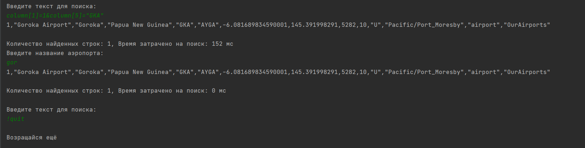

Приложение "Для поиска".
Пользователь запускает приложение:

java jar mySearch.jar // запуск приложения
> После запуска программа выводит в консоль предложение ввести фильтр.

Пользователь вводит « » column[1]>10&column[5]="GKA" , нажимает « » Enter .
> Программа просит ввести название аэропорта.

Например, пользователь вводит « » и нажимает « ». Программа выводит список всех
строк из файла найденых ранее, вторая колонка которых начинается на « », с учетом
фильтров, при этом строки отсортированные по колонке имени аэропорта в формате
« ».

Не буквенные и не цифровые символы также участвуют в поиске. Регистр букв не имеет
значения.

<Найденное значение нужной колонки>[<Полностью строка>]
Enter
airports.csv
> После вывода всех строк программа должна выводит число найденных строк и время в
миллисекундах, затраченное на поиск.
> Затем предложить снова ввести текст фильтра для поиска.
> Для того, чтобы завершить программу, нужно ввести текст «!quit»

>Пример работы программы
 

